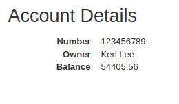

#Primary Goal
##Start service

The first step is to deploy all the services. We can do it by using the gradle integration of the IntelliJ IDE or by 
commands, **bootRun** in the IDE menu or **./gradlew :service_name:bootRun** in the terminal
1. Run Eureka server
   
2. Run account server
   
3. Run web service
   

##Check registered services dashboard
At this point we have the account service running on 2222 port and the web service on 3333 port

##Modify port of service
We need to change the port number of the account service to 4444, this number is set in 
``accounts/src/main/resources/application.yml``file at line number 7. After that, we deploy the new service as we have done
until now. The Eureka dashboard has been updated and we can see a new account service registered in 4444 port.

##Kill fist account service
If we kill the account service who is running in 2222 port and check the Eureka dashboard we can see:

The first service has disappeared, but if we try to access to the account service through the web by a request the web
service provide us the info about the account

This happens because Eureka still has registered one account service, and instead of requesting to a specific service the 
web service ask for a determinate type of service to Eureka.
